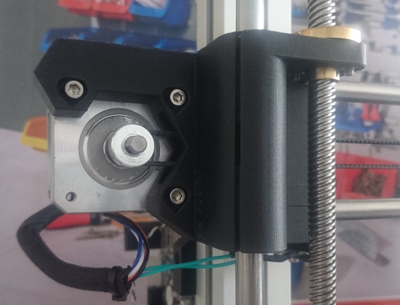
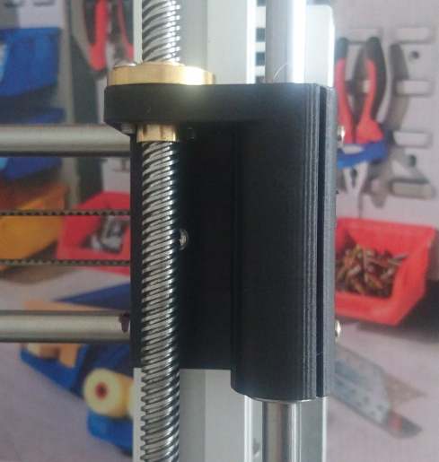
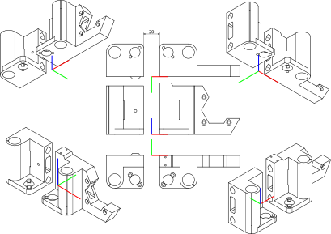

# X-ends

Vaším úkolem bude namodelovat mírně zjednodušené koncové součástky na X osu tiskáren podobného stylu jako jsou tiskárny RebeliX, se kterými se setkáte v předmětu. Tisknou se vzhůru nohama.




## Odevzdání a termíny

:warning: Toto je rc verze zadání domácího úkolu.
To znamená, že potenciální opravy chyb budou opatřeny erratou.
Uvítáme, pokud se na případné problémy zeptáte pomocí
[issue] v tomto repozitáři.

Založte repozitář: https://classroom.github.com/a/XAhF3pvj

Deadline odevzdání je **29.5.2019** 23:59 CEST

Vypracovaný úkol nahrajte do repozitáře vytvořeného na odkaze výše.
Nikam jinam jej neposílejte, jako odevzdání se počítá to,
co bude ve vašem repozitáři (ve výchozí větvi (většinou master))
v momentu deadlinu.

Pokud máte jakékoliv dotazy, či naleznete chyby, napište je prosím do
[issue] v tomto repozitáři.

[issue]: https://github.com/3DprintFIT/B182HW-Assignmet/issues

Po pushnutí commitu do vašeho repozitáře proběhne sada testů.
Testy vyžadují optickou kontrolu. Je k dispozici 12 testů.
Automatické testy se vyhodnocující na základě přesné optické schody.
Pozice modelu je proto zásadní.
Každý test je buďto splněn nebo nesplněn, v případě pochyb si obrázky překryjte přes sebe.

U každého testu uvidíte číselnou informaci o shodě pixelů. Nevěnujte ji zvláštní pozornost.
Dá se vykládat asi takto:

 * 1: vše v pořádku, v řešení postupujete stejně jako my
 * 0.999999: vše v pořádku, v řešení postupujete stejně jako my, ale jeden pixel někde ujel
 * 0.9998 a méně: nic neříkající informace (buďto je vše správně, ale postupujete trochu jinak a obrázek není úplně schodný, nebo máte v modelu chybu)

Pozor, že i prázdný obrázek dává vysoké hodnoty shody.
Není tedy možné předpokládat, že tato číslice snad udává podíl získaných bodů.

## Rozhraní

Váš model implementujte jako modul v OpenSCADu s tímto rozhraním:

```scad
module x_ends(
	base_height = 7,
	body_height = 60,
	wall_thickness = 3,
	vertical_horizontal_rods_offset = 23,
	tr_nut_hole = 12.5,
	tr_nut_mount_hole = 16,
	vertical_rods_distance = 25,
	smooth_rod_hole = 8.1,
	linear_bearing_hole = 15,
	split_width = 1,
	layer_height = 0.15,
	bolt_hole_diameter = 3.3,
	nut = 5.6,
	nut_thickness = 2.5,
	x_smooth_rods_distance = 45,
	pulley_inset = 10,
	pulley_distance_from_bottom_rod = 45/2,
	motor_size = 42.3,
	motor_hole_distance = 31,
	motor_offset = 3,
	endstop_inset = 7,
	endstop_distance_from_bottom_rod = 12,
	small_bolt_hole = 1.9,
	bolt_head_height = 3,
	bolt_head_diameter = 6,
	show_motor = true,
	show_idler = true
	)
{
    // ...
}
```

Smíte (je to dokonce žádoucí) vytvářet další pomocné moduly.
Smíte vytvářet další pomocné soubory (ale není to potřeba).

Váš modul musí jít použít následujícím způsobem z jiného souboru ve vašem
kořenovém adresáři vašeho repozitáře:

```scad
use <x_ends.scad>

x_ends();
```

Výchozí hodnoty argumentů musí **zůstat zachovány** dle tohoto rozhraní!
Naše testy budou jednotlivé argumenty nastavovat,
ale budou předpokládat stejné výchozí hodnoty!


## Parametry

Vámi namodelovaný model se bude skládat ze dvou částí: _motor_ a _idler_.
Pomocí argumentu `show_motor` (respektive  `show_idler`) lze zobrazení těchto
částí vypnout (respektive zapnout).
Nezobrazení jedné části nemá vliv na pozici části zobrazené.

Všechny další parametry udávají rozměry jednotlivých součástí dle přiložených
výkresů.


## Umístění v souřadném systému
Pro automatické testy je naprosto zásadní,
aby váš model byl umístěn na správném místě.
**Modely umístěné špatně budou vyhodnoceny jako nesprávné.**
Věnujte proto umístění modelu zvýšenou pozornost, požadovanou pozici najdete ve výkresech ([svg](drawings/position.svg), [png](drawings/position.svg.png)).




# Výkresy

Poznámka: Kóty *a* a *b* označují pouze rovnost stejně okótovaných částí.

## Báze


Byť máte za úkol modelovat jen dvě součástky, výkresy jsou tři. To je z důvodu, že obě dvě součástky sdílejí většinu rozměrů.
Na výkresu báze ([svg](drawings/base_drawing.svg), [png](drawings/base_drawing.svg.png)) najdete právě tyto sdílené rozměry.
Dále máte k dispozici obrázky projekcí této základní součástky ([svg](drawings/base_projections.svg), [png](drawings/base_projections.svg.png)), případně jsou k dispozici také jen okótované výkresy bez projekcí  ([svg](drawings/base_dimensions.svg), [png](drawings/base_dimensions.svg.png)).

## Idler (část _idler_)


Výkresy `idleru` najdete na [svg](drawings/idler_drawing.svg) a [png](drawings/idler_drawing.svg.png). Případně jsou zase dostupné pouze okótované výkresy ([svg](drawings/idler_dimensions.svg), [png](drawings/idler_dimensions.svg.png)) a také pouze projekce ([svg](drawings/idler_projections.svg), [png](drawings/idler_projections.svg.png)).

## Motor (část _motor_)


Výkresy `motoru` najdete na [svg](drawings/motor_drawing.svg) a [png](drawings/motor_drawing.svg.png). Případně jsou zase dostupné pouze okótované výkresy ([svg](drawings/motor_dimensions.svg), [png](drawings/motor_dimensions.svg.png)) a také pouze projekce ([svg](drawings/motor_projections.svg), [png](drawings/motor_projections.svg.png)).


## Obě části
Výkresy obou částí dohromady jsou vidět na výše zmíněných výkresech vyznačující jejich pozici v souřadném systému ([svg](drawings/position.svg), [png](drawings/position.svg.png)).

## Nefunkční požadavky

  - Manipulace s `$f*` hodnotami je povolena pouze pro konstrukci pravidelných šestiúhelníků (např. pro matičky)
  - Je zakázáno použít konstrukci `minkowski()` (ve 3D i ve 2D prostoru)
  - Není doporučováno používat rekurzi, ani to k vyřešení úkolu není zapotřebí
  - Využití externích knihoven (včetně knihovny MCAD) je zakázáno
  - Pokud je něco **zakázáno**, vede použití k tomu, že **neprojdou testy** a dostáváte **0 bodů**
  - Váš kód musí splňovat určitou kvalitu (**tato část tvoří 6 bodů z celkových 30 možných**)
    - Opakování v kódu je špatně, vždy použijte moduly a cykly
    - Bulharské konstanty musí být doplněny o vysvětlující komentář
    - Dodržte logickou úroveň odsazení
